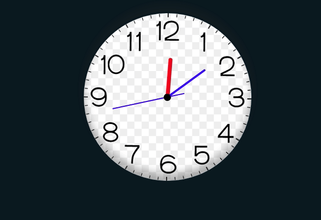

#### Simple Clock HTML + CSS + JS

Feel free to use the code shared here, improvements and criticisms are always accepted.

Simple clock made by html, js and css, can be reproduced in react, vue, angular and other frameworks for frontend easily

